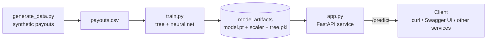
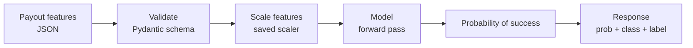

# Payout Success Predictor — Project Design

> A small, end-to-end ML service that predicts whether a freelancer **payout will succeed or fail** at the moment it's initiated, exposed over an API. Built as a learning project on **synthetic** data modeled on real payout-risk intuition (no real or confidential data).

---

## 1. Problem Statement

In a global payments platform, money-out (payouts) to freelancers sometimes **fails or is rejected** after initiation — due to high-risk destination corridors, KYC/name mismatches, stale accounts, or unusually large amounts. Each failure creates downstream cost: support tickets, delayed funds, retries, and a poor freelancer experience.

Today these failures are mostly discovered **after** they happen. The question this project explores:

> *Given the attributes of a payout at the moment it is initiated, can we predict the probability that it will succeed — early enough to act on it (route differently, warn, hold, or verify)?*

This is a **binary classification** problem: predict `success` (1) vs `failure` (0) from a handful of payout features.

---

## 2. Product Requirements (PRD)

### Background & motivation
A predictive "payout success score" lets operations and risk teams move from reactive cleanup to proactive handling — improving payout success rate, reducing support load, and improving freelancer trust.

### Goals
- Predict the probability a payout will succeed from its features.
- Expose the prediction as a **real-time API** that any service can call.
- Be **explainable** enough to trust (which features drive the score).
- Compare a **classic model (decision tree)** against a **neural network** to understand the trade-offs.

### Non-goals
- Not a production fraud/AML system.
- Not trained on real data (synthetic only, for learning).
- No real-time/online learning; training is offline and batch.
- No UI beyond the API and its auto-generated docs.

### Users & use cases
- **Payout orchestration service** — calls the API at initiation to get a success score and decide routing/hold.
- **Risk/Operations** — reviews scores and the features driving them.
- **(Learning) the author** — to master the full ML lifecycle end to end.

### Functional requirements
1. Generate a reproducible synthetic dataset of payout attempts.
2. Train and evaluate a decision-tree model (baseline) and a neural-net model.
3. Persist the trained model and any preprocessing (e.g., feature scaler).
4. Serve a `/predict` endpoint that accepts payout features and returns a success probability + predicted class.
5. Provide input validation and clear error responses.

### Non-functional requirements
- **Latency:** single prediction < ~100 ms.
- **Reproducibility:** fixed random seeds; same data and results every run.
- **Testability:** model and API independently testable.
- **Documentation:** this design doc + a README + auto-generated API docs.

### Success metrics
- Model **accuracy / ROC-AUC** on a held-out test set clearly beats the majority-class baseline (~0.51).
- `/predict` returns correct, validated responses for valid and invalid inputs.
- Author can explain every component and every line.

---

## 3. High-Level Design (HLD)

### Architecture overview

### Data flow (single prediction)

### Data model — features
| Feature | Type | Meaning |
|---|---|---|
| `amount` | float | Payout amount (USD) |
| `account_age_days` | int | Age of the freelancer account |
| `prior_payouts` | int | Count of prior successful payouts |
| `corridor_risk` | float 0–1 | Risk score of the destination corridor |
| `mismatch_flags` | int 0–5 | KYC / name-mismatch flags |
| `weekend` | 0/1 | Initiated on a weekend |
| **`success`** (label) | 0/1 | 1 = succeeded, 0 = failed/rejected |

### Model approach & trade-offs
| | Decision Tree (baseline) | Neural Network (PyTorch) |
|---|---|---|
| Interpretability | High (feature importances, visualizable rules) | Lower (weights are opaque) |
| Setup | Trivial (`fit`) | Needs training loop, scaling, tuning |
| Strength here | Fast, explainable baseline | Learns smooth/continuous relationships; scales to richer data |
| Why include both | The honest baseline + the "how it was built before" refresher | The new skill: tensors, forward/backward pass, loss, optimizer |

### Serving design
- **FastAPI** app loads the trained model + scaler **once at startup**.
- **Pydantic** model defines and validates the request body.
- `POST /predict` → returns `{ success_probability, predicted_class, label }`.
- **uvicorn** runs the server; FastAPI auto-generates interactive docs at `/docs`.

### Artifacts produced
- `payouts.csv` — the dataset
- `model.pt` (+ `scaler.pkl`) — trained neural net and feature scaler
- `tree.pkl` — baseline decision tree
- `app.py` — the API service
- `DESIGN.md` (this) + `README.md`

### Failure modes & edge cases
- **Invalid/missing fields** → 422 validation error from Pydantic (handled).
- **Out-of-range values** (e.g., negative amount) → validated/clamped.
- **Model file missing at startup** → fail fast with a clear error.
- **Class imbalance / drift** (future, with real data) → monitor and retrain.

### Future / productionization
- Containerize with **Docker**; deploy to a cloud run target.
- Add an **evaluation harness** (ROC-AUC, calibration) and basic monitoring.
- Add **auth** and rate limiting.
- Swap synthetic data for real data behind proper privacy controls; add a model registry/versioning.

---

## 4. Why this project (interview framing)
This demonstrates the **full ML lifecycle** — problem framing → data → model (classic vs neural) → evaluation → **deployment behind an API** — grounded in a payments domain the author owned in production. It shows the author can not only build a model but **ship and serve** it, and reason about trade-offs, failure modes, and productionization like an architect.
