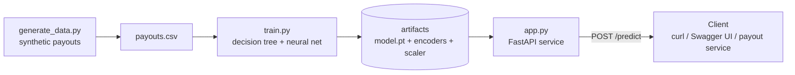
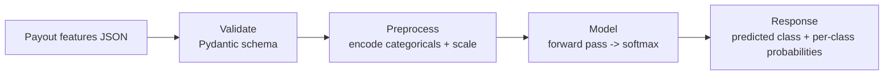

# Payout Success & Failure-Reason Predictor

**Author:** Bharat Talwar
**Origin:** Internal hackathon proof-of-concept
**Status:** POC on synthetic data (no real or confidential data is used)

> **In one line:** At the moment a freelancer payout is initiated, this service predicts whether it will **succeed** — and if not, **which failure reason** is most likely — and exposes that prediction over an API so any payout service can call it in real time. The data is synthetic, modeled on payout behavior I worked with on a marketplace payments platform.

---

## Design Rationale — the thinking behind the code (what actually differentiates this)

Anyone can generate a working ML script with an AI tool in minutes. What makes this project *mine* is the reasoning behind four decisions — each documented in this doc:

1. **How I identified the features** — from domain knowledge of what actually drives payout failures (method state, bank-data validity, name match, amount, account history), not a generic feature dump. → *Appendix B.*
2. **How I created the test data and chose each RNG function** — I matched each field's random distribution to the real-world *shape* of that quantity (money → right-skewed `gamma`, flags → `binomial`, counts → `poisson`, 0–1 rates → `beta`). → *Appendix B.*
3. **How I computed the outcome** — each outcome gets a transparent points score from its real drivers (`baseline + Σ weight × flag`, highest wins); the weights were chosen by a deliberate "contribution-budget" method and calibrated to a realistic class mix. → *Appendix C.*
4. **How I chose the ML algorithm** — started with an interpretable baseline (decision tree), compared stronger ensembles (random forest, gradient boosting), and selected on **macro-F1** (not accuracy, because the classes are imbalanced). Gradient boosting won — the expected result for tabular data. → *Section 4 and `CONCEPTS_AND_INTERVIEW.md`.*

The code is the easy part. These four judgment calls are the engineering, and they're what I should be able to defend.

---

## 1. Problem Statement

On a global marketplace, we move money **out** to freelancers across many rails (local bank/DLB, Wise, Thunes wallets, Payoneer, PayPal, ACH, wire) and many corridors. A meaningful share of payouts — especially **batch weekly payouts** that go out automatically for hourly work — fail or get held. In practice the biggest culprits were **method-of-payment (MOP) issues** and **bank/IBAN validation**, not funding (this is money out, so an account balance is never the constraint).

The pain was that failures were mostly discovered **after** the attempt: a payout would fail, a ticket would open, the freelancer would wait, and only then would someone fix the underlying MOP or bank detail.

I wanted to answer a sharper question at the moment of initiation:

> *Will this payout succeed — and if not, what is the most likely reason it will fail?*

Predicting the **reason**, not just success/failure, is what makes the output actionable: ops (or an automated flow) can re-verify a stale MOP, prompt the freelancer to correct bank details, or hold a high-risk corridor payout — **before** the failed attempt happens.

---

## 2. Product Requirements (PRD)

### Background & motivation
A real-time "payout outcome" prediction lets us shift from reactive cleanup to proactive prevention — lifting payout success rate, cutting support load, and getting freelancers paid on time. I built this as a hackathon POC to show the idea was feasible end to end; in a real rollout, our product and data-analytics partners would own the rigorous feature research.

### Goals
- Predict, at initiation, the **outcome class**: `SUCCESS` or a specific failure reason.
- Expose it as a **real-time API** any payout/orchestration service can call.
- Keep it **explainable** enough to trust and act on (which features drove the prediction).
- Compare a **decision-tree baseline** with a **neural network** to understand the trade-offs.

### Non-goals
- Not a production fraud/AML system.
- Not trained on real data — synthetic only, for the POC.
- No online/real-time training; training is offline and batch.
- No UI beyond the API and its auto-generated docs.

### Users & use cases
- **Payout orchestration service** — calls at initiation; uses the predicted reason to route, hold, or trigger a fix.
- **Risk / Operations** — reviews predicted failure reasons and the drivers behind them.

### Functional requirements
1. Generate a reproducible synthetic dataset of payout attempts with realistic feature correlations.
2. Train and evaluate a decision tree (baseline) and a neural network (multi-class).
3. Persist the trained model and preprocessing artifacts (encoders/scaler).
4. Serve a `/predict` endpoint returning the predicted outcome class **and** the probability of each class.
5. Validate inputs and return clear error responses.

### Non-functional requirements
- **Latency:** single prediction < ~100 ms.
- **Reproducibility:** fixed seeds; identical data and results each run.
- **Testability:** model and API independently testable.
- **Documentation:** this design doc, a README, and auto-generated API docs.

### Success metrics
- **Macro-F1** (not just accuracy) clearly beats the majority-class baseline — because the classes are imbalanced and I care about catching the *failure* reasons, not just the common SUCCESS case.
- Correct, validated `/predict` responses for valid and invalid inputs.
- I can explain every component and every line.

---

## 3. Data Model

### Target — multi-class outcome (5 classes)
| Class | What it means (root cause → fix) |
|---|---|
| `SUCCESS` | Payout completes on first attempt |
| `FAIL_MOP` | The payout **method** isn't usable — unverified or recently changed → re-verify the method |
| `FAIL_BANK_VALIDATION` | The **bank account data** (IBAN/routing) is invalid — often a stale IBAN the bank rotated → correct the bank details |
| `FAIL_NAME_MISMATCH` | The **beneficiary name** doesn't match the account holder — the name is captured with the MOP *after* KYC, and special characters break the match → fix the name |
| `FAIL_AMOUNT_LIMIT` | A large payout trips a **limit / manual review** → split or manually approve |

I deliberately scoped this to the five outcomes I actually lived with. Each maps to a **distinct remediation**, which is what makes predicting the *reason* useful (not just success vs. fail). `SUCCESS` is the majority (~60%) and the four failure modes are each well-represented (~8–11%). I considered rarer reasons — KYC/eligibility, sanctions/compliance holds, corridor/vendor delivery issues — but left them out of the POC on purpose: each was well under 1% of volume, not learnable at this data size, and overlapped with the core five. That's an explicit scoping decision; in a real build they'd be added once there's enough labeled data to support them.

### Features (16)
| Group | Feature | Type | Signal |
|---|---|---|---|
| **Payout** | `amount_usd` | num | Large payouts hit limits / review → `FAIL_AMOUNT_LIMIT` |
| | `payout_method` | cat | dlb_bank / wise / thunes_wallet / payoneer / paypal / ach / wire |
| | `destination_region` | cat | NAM / EU / LATAM / SSA / MENA / SEA / SA (context) |
| | `is_batch_payout` | bool | Batch weekly payouts → more MOP/bank failures |
| **Account history** | `account_age_days` | num | Newer → riskier |
| | `prior_successful_payouts` | num | Track record → success |
| | `historical_failure_rate` | num 0–1 | Past failures predict future |
| | `days_since_last_payout` | num | Dormancy → stale method |
| | `top_rated_status` | cat 0–3 | Vetted freelancers succeed more |
| **Method & verification** | `mop_age_days` | num | Freshly added MOP → `FAIL_MOP` |
| | `mop_verified` | bool | Unverified MOP → `FAIL_MOP` |
| | `recent_bank_change_flag` | bool | Method recently changed → `FAIL_MOP` |
| | `bank_account_valid` | bool | Invalid IBAN/routing → `FAIL_BANK_VALIDATION` |
| | `bank_detail_age_days` | num | Old record → bank may have rotated the IBAN → stale/invalid |
| | `name_match_score` | num 0–1 | Low → `FAIL_NAME_MISMATCH` |
| | `name_has_special_chars` | bool | Special characters break beneficiary matching → `FAIL_NAME_MISMATCH` |

*(I dropped the features that only existed to drive the removed classes — KYC status, tax form, sanctions, corridor/vendor rates, disputes — so every remaining feature relates to one of the five outcomes. `destination_region` and `payout_method` are kept as realistic context; the model can tell us how much they actually matter.)*

### Synthetic data approach
I generate each feature from a plausible distribution, then derive the outcome from a transparent scoring function: each failure reason has a score driven by its real-world causes, `SUCCESS` has a baseline boosted by good history, and the outcome is the highest-scoring class plus noise (so it's probabilistic, not deterministic). The strong, deliberate correlations I bake in mirror what I actually observed:

- **Amount** — larger payouts sharply raise `FAIL_AMOUNT_LIMIT` (limit/review thresholds).
- **Name** — a low `name_match_score` or `name_has_special_chars = 1` drives `FAIL_NAME_MISMATCH`, reflecting that the beneficiary name is captured with the MOP *after* KYC, so it can diverge from the verified identity.
- **Bank/IBAN** — `bank_account_valid = 0` (more likely when `bank_detail_age_days` is high, i.e., the bank rotated the IBAN and we hold a stale one) drives `FAIL_BANK_VALIDATION`, amplified for batch payouts.
- **MOP** — unverified or freshly-changed methods drive `FAIL_MOP`, again worse for batch runs.

Baking in **known, defensible correlations** is what lets the model learn something real — and lets me explain *why* it predicts what it does.

---

## 4. High-Level Design (HLD)

### Architecture


### Data flow — a single prediction


### Model approach & trade-offs
| | Decision Tree (baseline) | Neural Network (PyTorch) |
|---|---|---|
| Interpretability | High (feature importances) | Lower (opaque weights) |
| Multi-class | Native | Softmax + cross-entropy |
| Strength here | Fast, explainable reference | Learns smoother relationships; extends to richer data |
| Why both | Honest baseline + the classic approach | The new skill: tensors, forward/backward pass, loss, optimizer |

### Evaluation (production-minded)
Because the classes are imbalanced (~60% `SUCCESS`), I don't rely on accuracy alone. I evaluate with **macro-F1**, **per-class precision/recall**, and a **confusion matrix** to see *which* failure reasons the model confuses. I also tested **class weighting**: it lifts recall on the rarer classes but lowers overall accuracy, so the right setting is a business call — the cost of a missed failure vs. a false alarm — not a default. (A shallow tree with aggressive weighting actually collapses accuracy by over-predicting rare classes, which is a good reminder that imbalance fixes have to be tuned, not switched on blindly.)

### Serving
- **FastAPI** loads the model + preprocessing artifacts **once at startup**.
- **Pydantic** validates the request body.
- `POST /predict` → `{ predicted_class, probabilities{...} }`.
- **uvicorn** runs it; interactive docs auto-generated at `/docs`.

### Artifacts
`payouts.csv`, `model.pt` (+ encoders/scaler), `tree.pkl`, `app.py`, `DESIGN.md`, `README.md`.

### Failure modes & edge cases
- Invalid/missing fields → 422 validation error (Pydantic).
- Unknown categorical value → handled by the encoder / mapped to an "unknown" bucket.
- Model artifact missing at startup → fail fast with a clear error.
- Class drift over time (with real data) → monitor macro-F1 and retrain.

### Future / productionization
Containerize with Docker; deploy to a cloud run target; add an automated evaluation + monitoring job; add auth and rate limiting; replace synthetic data with real data behind privacy controls; add a model registry and versioning.

---

## 5. Why I built it this way
I deliberately framed this as a small but *complete* system — problem framing, a documented data model, a baseline before a fancy model, honest evaluation under class imbalance, and a real served API — rather than a notebook that prints an accuracy number. It mirrors how I approach architecture in production: define the problem and the system of record first, design for failure and observability, and make the trade-offs explicit.

---

# Appendix — Data Generation Deep Dive (my revision notes)

> Plain-English, from-scratch explanation of **how and why** the synthetic data is built. This is my one-stop revision for the data-generation parts of the project. Since the data is synthetic, *I* author the "truth" the model later learns — so I need to be able to explain every choice and its intuition.

**Terminology check (say this correctly in interviews):**
- **Feature / input field** = a column the model reads (the 16 inputs).
- **Label / target / outcome class** = the answer the model predicts (`OUTCOME_CLASSES`, one of 5).
- **Classifier** = the *algorithm* that learns features → label (decision tree, gradient boosting). The classes are *not* the classifier.

---

## A. The outcome classes — Section 2A (what they are & why)

**What this is:** `OUTCOME_CLASSES` is the list of 5 possible answers the model can give for a payout.

**Why classification (not regression):** the answer is a *category* (which outcome), not a number.

**Why multi-class (not just pass/fail):** predicting *which* failure is what makes the output **actionable** — each reason points to a different fix. A binary "will fail" tells ops nothing about what to do.

**The 5 classes, what each means, and the fix it implies:**

| Class | Plain meaning | What it represents | The remediation it points to |
|---|---|---|---|
| `SUCCESS` | The payout will go through | Clean payout, good history, valid method | none |
| `FAIL_MOP` | The payment **method** isn't usable | Unverified, brand-new, or just-changed payout method | re-verify / confirm the method |
| `FAIL_BANK_VALIDATION` | The **bank data** is wrong | Invalid IBAN/routing, often a stale number the bank rotated | correct the bank details |
| `FAIL_NAME_MISMATCH` | The **name** doesn't match | Beneficiary name ≠ account holder (special characters; name added with the MOP after KYC) | fix the beneficiary name |
| `FAIL_AMOUNT_LIMIT` | The **amount** trips a limit | Large payout hits a threshold / manual review | split or manually approve |

**Why these five, and why I dropped others:** these are the failure modes I actually saw dominate (especially MOP and bank/IBAN on automatic batch payouts, plus amount limits and name mismatches). I considered KYC, sanctions/compliance, and corridor/vendor failures but dropped them from the POC because each was <1% of volume — too rare for a model to learn at this data size — and they overlapped with the core five. **Intuition to convey:** a good label set is *mutually exclusive* (no overlap) and *actionable* (each maps to a distinct fix). Scoping to five well-separated, common, fixable outcomes is a deliberate design choice, not laziness.

---

## B. The 16 input features — Section 2B (meaning, distribution & why that RNG)

**The big idea (this unlocks the whole section):** a feature is a real-world quantity. To *fake* it realistically, I pick a random-number function whose **shape** matches how that quantity behaves in real life. Choosing the distribution = choosing the right shape.

A 30-second guide to the shapes (from my revision notes):

| RNG function | What it produces (shape) | Use it for |
|---|---|---|
| `rng.choice(opts, p=...)` | picks a **category**, with optional proportions | category fields |
| `rng.gamma(shape, scale)` | **positive, right-skewed** (many small, few large) | money / amounts |
| `rng.binomial(1, p)` | a **0/1 flag**, "yes" with probability p | yes/no flags |
| `rng.integers(low, high)` | **whole numbers**, evenly spread | ages / day counts |
| `rng.poisson(lam)` | **counts** of events (≥0 integers, avg = lam) | "how many times" |
| `rng.beta(a, b)` | a number strictly **between 0 and 1** | rates / scores / probabilities |
| `rng.uniform(lo, hi)` | a **flat** random number in a range | thresholds / building flags |
| `rng.normal(mean, std)` | the **bell curve** (symmetric noise) | jitter around a value |

**Each feature, what it means, and why its distribution:**

*Payout context*
| Feature | Means | Why this RNG |
|---|---|---|
| `destination_region` | where the money is going | `choice` with weights — a category with realistic regional proportions |
| `payout_method` | the rail (bank, Wise, Thunes…) | `choice` with weights — category; bank/DLB most common |
| `amount_usd` | payout size in USD | `gamma` — money is positive and right-skewed (lots of small payouts, a few big) |
| `is_batch_payout` | weekly auto-batch vs manual | `binomial(1, 0.6)` — a yes/no flag, ~60% batch |

*Account history*
| Feature | Means | Why this RNG |
|---|---|---|
| `account_age_days` | how old the account is | `integers` — a whole-number span of days |
| `prior_successful_payouts` | past successful payouts | `poisson` — a **count**; I tie its average to age so older accounts have more (a built-in correlation) |
| `historical_failure_rate` | share of past payouts that failed | `beta` — must sit in **0–1**; shaped to pile up near 0 (most accounts rarely fail) |
| `days_since_last_payout` | dormancy | `integers` — whole days |
| `top_rated_status` | 0–3 vetting tier | *derived* from `prior_successful_payouts` (not random) — realistic correlation |

*Method & verification*
| Feature | Means | Why this RNG |
|---|---|---|
| `mop_age_days` | how long the method has been on file | `integers` — whole days |
| `mop_verified` | is the method verified | `binomial` — yes/no flag, ~88% verified |
| `bank_detail_age_days` | age of our stored bank record | `integers` — whole days |
| `bank_account_valid` | does the IBAN/routing pass | `uniform` → flag: I build a probability of being invalid that **rises with `bank_detail_age_days`** (stale IBAN story), then flip the coin |
| `name_has_special_chars` | special characters in the name | `binomial` — yes/no flag, ~14% |
| `name_match_score` | how well the name matches | `beta` (0–1), **minus a penalty** when special chars are present |
| `recent_bank_change_flag` | bank details changed recently | `binomial` — yes/no flag, ~12% |

**Two intuition points worth saying out loud:**
1. **Bounded vs. unbounded:** rates/scores that must live in 0–1 use `beta`; positive skewed money uses `gamma`; plain whole numbers use `integers`; yes/no uses `binomial`. Match the shape to the quantity.
2. **I deliberately build correlations** (top-rated from prior payouts; invalid-bank more likely when the record is stale; name-match lower when special chars exist). Independent random columns would teach the model *nothing*; the correlations are the signal it learns.

---

## C. The outcome formulae — Section 2C (the intuition, step by step)

This is the part to really understand. **How does each row get its label?**

### The one pattern behind everything
For each row, I compute a **score for each of the 5 outcomes**, then the highest score wins:

```
score_for_an_outcome = baseline + (weight₁ × flag₁) + (weight₂ × flag₂) + ...
```

- A **flag** is usually a True/False test, e.g. `(mop_verified == 0)`. Python treats `True` as **1** and `False` as **0**.
- `weight × flag` means **"add this many points *if* the flag is on."** When the flag is off it contributes 0.
- We **add** the terms to **stack up evidence**: more (or stronger) red flags → higher score for that failure.
- The outcome with the **highest total** is the label (`argmax`), after adding a little random **noise** so it isn't perfectly deterministic.

**Why multiply, then add?** The flag is a *switch* (0 or 1); the weight is *how many points that switch is worth.* `weight × flag` converts the switch into points; summing the terms combines all the evidence. (We don't multiply flags *by each other* — that would model interactions; additive is simpler and easier to explain.)

### Why each formula looks the way it does

**`s_success`** starts every payout as *probably fine* and adjusts for history:
```
s_success = 2.6 + 0.04·min(prior_successful_payouts, 50) + 0.5·top_rated_status
            − 3.0·historical_failure_rate + 0.0004·account_age_days
```
- `2.6` baseline = "innocent until proven guilty."
- `+ prior payouts` and `+ top_rated` = good track record pushes toward success (capped at 50 so one whale doesn't dominate).
- `− 3.0·historical_failure_rate` = a bad track record pulls it down (note the **minus**).
- `+ account_age` = older accounts are a bit safer.

**`s_mop`** = the method-problem red flags, stacked:
```
s_mop = 3.0·(not verified) + 1.7·(method <30 days old) + 1.6·(is batch)
        + 1.0·(recent bank change) + 0.6·(dormant >180 days)
```
Biggest weight (3.0) on the main cause (unverified); smaller weights amplify (new method, batch run, recent change, dormancy). Each is a switch worth its weight.

**`s_bank`** = bank-data red flags:
```
s_bank = 2.6·(invalid bank) + 1.3·(record >730 days old) + 0.9·(is batch) + 0.5·(dlb_bank)
```
Main cause invalid IBAN (2.6); a stale record and batch runs raise it; local-bank rails fail a touch more.

**`s_name`** = name red flags:
```
s_name = 2.9·(match < 0.6) + 2.2·(has special chars) + 1.0·(match < 0.8)
```
A low match is the strong signal; special chars add a lot; a *mildly* low match adds a little. (The two match thresholds let a *very* low score score higher than a *slightly* low one.)

**`s_amount`** = the only one driven by a continuous number:
```
amount_z  = (amount − mean) / std          # standardize to a 0-centred scale
s_amount  = 2.4·max(amount_z, 0) + 3.2·(amount > 900) + 2.0·(amount > 1500)
```
- **Why standardize (`amount_z`)?** Amounts run from ~$20 to ~$2,500 — a huge range that would swamp the other terms. Standardizing rescales it to a ~0-centred number so its weight is comparable. `max(…, 0)` means only *above-average* amounts add risk.
- The two step bonuses (`>900`, `>1500`) model real **limit thresholds** — crossing a limit jumps the risk.

### How I chose the weights — the data-scientist thought process
This is the part that shows judgment. The coefficients aren't arbitrary or "scientific" — each is a deliberate choice made in **three steps**:

1. **Direction (the sign):** does this driver make the outcome *more* or *less* likely? Good history → `+`; a bad signal like failure rate → `−`.
2. **Magnitude (the "contribution-budget" trick):** decide how many points I want a driver to add *at its maximum*, then divide by the variable's range:
   `coefficient ≈ (points I want at the max) ÷ (the variable's max value)`
3. **Calibration:** run the generator, look at the resulting class distribution, and nudge the baseline/weights until the mix is realistic. (I literally lowered the success baseline from 3.0 → 2.6 to move SUCCESS from ~65% to ~60%.)

`s_success`, derived term by term with that method:

| Term | Variable range | Direction | Points wanted at max | ⇒ coefficient |
|---|---|---|---|---|
| baseline | — | the default ("innocent until proven guilty") | — | **2.6** (set by calibration) |
| `prior_successful_payouts` | 0–50 (capped via `min`) | + good history | ~ +2 | 2 ÷ 50 = **0.04** |
| `top_rated_status` | 0–3 | + | ~ +1.5 | 1.5 ÷ 3 = **0.5** |
| `historical_failure_rate` | 0–1 | − bad signal (strong) | ~ −3 | 3 ÷ 1 = **−3.0** |
| `account_age_days` | 1–2400 | + | ~ +1 | 1 ÷ 2400 ≈ **0.0004** |

That's why a huge-range variable (age) gets a *tiny* coefficient while a 0–1 variable (failure rate) gets a *big* one — both are budgeted to a sensible **number of points**, so no single field accidentally dominates. The same three steps produced every other score (`s_mop`, `s_bank`, `s_name`, `s_amount`): pick the driving fields → set each sign → budget each magnitude → calibrate against the output distribution.

**Interview-honest version:** "These weights are *authored*, not learned — I'm synthesizing data, so I designed plausible, scale-aware relationships and tuned them to a realistic class mix. On real data you don't pick weights; the model learns them — there my job is feature engineering and evaluation, not setting coefficients."

### Crucial distinction: the generator's weights vs. the model's weights
There are **two completely separate sets of "weights"** here, and they never touch:

1. **My hand-set coefficients** (above) are used **once** — only to fabricate the ground-truth `outcome` label for the synthetic data. They are the hidden "answer key."
2. **The model's own learned parameters** (the tree's splits / the booster's structure) are what the model figures out **by itself** from the finished table. The model **never sees my formula or coefficients** — only the columns (features + `outcome`). Training is essentially the model trying to *reverse-engineer* the relationship I baked in; ~86% accuracy means it largely succeeded.

Mental picture: *I write a secret rulebook → stamp a label on every row with it once → hand the model only the rows → the model rediscovers the rulebook from scratch.*

**In production, this generation step disappears entirely.** Real payouts succeed or fail on their own — reality writes the labels. You collect `(features, real outcome)` and the model learns; you never invent coefficients. So coefficient design is a **synthetic-data-only** concern. With real data my job shifts to **feature engineering, data quality, and evaluation**, not setting weights.

**Limitation to state plainly:** the model can't learn anything richer than the patterns I put into the synthetic data — this is a scaffold to build and validate the *pipeline*, not evidence it would perform on messy real-world data.

**Q: If the model underperformed, would you change the generator (e.g., bump the success baseline 2.6 → 3.6)?**
No — that would be **circular**. The generator is the *answer key* (it stands in for reality); editing it to make the model look better is like changing an exam's answer key to match a student's wrong answers — it proves nothing, just makes the problem easier. And in production it's impossible: reality writes the labels, you don't control them. When a model underperforms you change the **model side** — features, algorithm (tree → RF → gradient boosting), hyperparameters, imbalance handling, or get more/better data — **never the ground truth.** The *only* legitimate reason to touch the generator is **realism** (make the fake data behave more like the real world), and that's a decision made on realism grounds, ideally before optimizing any model — not a reaction to a low score.

### Why `gumbel` noise + `argmax`
```
scores  = stack the 5 score columns  +  rng.gumbel(0, 0.4, ...)
outcome = the class with the highest score
```
- `argmax` alone = deterministic (identical inputs always same label).
- Adding **Gumbel noise** before `argmax` turns it into a *probabilistic draw* — two near-identical payouts won't always get the same label, which is realistic. (Mathematically, argmax over scores + Gumbel noise = sampling in proportion to the scores.)

### Worked example (do this by hand once — it makes it click)
A **new account with an unverified, just-added method, in a batch run, dormant**:
`prior=0, top_rated=0, hist_fail=0.3, age=50, mop_verified=0, mop_age=5, is_batch=1, recent_change=1, days_since=200, small amount, good name/bank`

- `s_success = 2.6 + 0 + 0 − 3.0·0.3 + 0.0004·50 ≈ 2.6 − 0.9 + 0.02 = 1.72`
- `s_mop = 3.0·1 + 1.7·1 + 1.6·1 + 1.0·1 + 0.6·1 = 7.9`
- `s_bank ≈ 0`, `s_name ≈ 0`, `s_amount ≈ 0`

Highest is **`s_mop` (7.9 ≫ 1.72)** → the row is labeled **`FAIL_MOP`.** You can *see* the red flags stacking: unverified (+3.0) + new (+1.7) + batch (+1.6) + recent change (+1.0) + dormant (+0.6) overwhelm the modest success baseline. A clean payout would have `s_success ≈ 6+` and all failure scores ≈ 0 → **`SUCCESS`**. A $2,500 payout would make `s_amount` huge → **`FAIL_AMOUNT_LIMIT`**.

**The honest framing for an interview:** "These weights aren't learned or precise — I *hand-set* them to encode plausible relative strengths of each known cause, because I'm *synthesizing* the data (authoring the ground truth). With real data you wouldn't invent the relationship — you'd collect labeled outcomes and let the model discover it. Here, designing transparent, defensible correlations is exactly what lets the model learn something real and lets me explain its behavior."

---

## D. RNG cheat-sheet (quick revision)
`choice` → categories · `gamma` → money (skewed) · `binomial` → yes/no flags · `integers` → whole numbers/days · `poisson` → event counts · `beta` → 0–1 rates/scores · `uniform` → flat randomness / building flags · `normal` → symmetric noise. Always `rng = np.random.default_rng(seed)` for reproducibility.

## E. Metrics cheat-sheet (quick revision; full deep-dive is a separate session)
- **Confusion matrix:** rows = actual, cols = predicted. **TP/TN/FP/FN.** (Multi-class: read it one class at a time — that class vs. everything else.)
- **Accuracy** = (TP+TN)/all — *"how often was I right?"* Misleading on imbalanced data.
- **Precision** = TP/(TP+FP) — *"when I say X, can I be trusted?"* False alarms hurt it.
- **Recall** = TP/(TP+FN) — *"of the real X's, how many did I catch?"* Misses hurt it.
- **F1** = 2·(P·R)/(P+R) — balances precision and recall; high only when *both* are decent.
- **Macro-F1** = average of each class's F1, weighting all classes **equally** — the right headline metric here because it refuses to let the common SUCCESS class hide poor failure detection.
- **classification_report** = precision/recall/F1/support per class in one table (`support` = how many real examples of that class).
