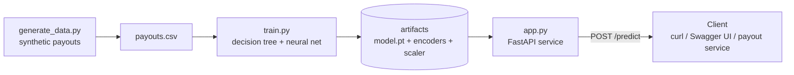

# Payout Success & Failure-Reason Predictor

**Author:** Bharat Talwar
**Origin:** Internal hackathon proof-of-concept
**Status:** POC on synthetic data (no real or confidential data is used)

> **In one line:** At the moment a freelancer payout is initiated, this service predicts whether it will **succeed** — and if not, **which failure reason** is most likely — and exposes that prediction over an API so any payout service can call it in real time. The data is synthetic, modeled on payout behavior I worked with on a marketplace payments platform.

---

## 1. Problem Statement

On a global marketplace, we move money **out** to freelancers across many rails (local bank/DLB, Wise, Thunes wallets, Payoneer, PayPal, ACH, wire) and many corridors. A meaningful share of payouts — especially **batch weekly payouts** that go out automatically for hourly work — fail or get held. In practice the biggest culprits were **method-of-payment (MOP) issues** and **bank/IBAN validation**, not funding (this is money out, so an account balance is never the constraint).

The pain was that failures were mostly discovered **after** the attempt: a payout would fail, a ticket would open, the freelancer would wait, and only then would someone fix the underlying MOP or bank detail.

I wanted to answer a sharper question at the moment of initiation:

> *Will this payout succeed — and if not, what is the most likely reason it will fail?*

Predicting the **reason**, not just success/failure, is what makes the output actionable: ops (or an automated flow) can re-verify a stale MOP, prompt the freelancer to correct bank details, or hold a high-risk corridor payout — **before** the failed attempt happens.

---

## 2. Product Requirements (PRD)

### Background & motivation
A real-time "payout outcome" prediction lets us shift from reactive cleanup to proactive prevention — lifting payout success rate, cutting support load, and getting freelancers paid on time. I built this as a hackathon POC to show the idea was feasible end to end; in a real rollout, our product and data-analytics partners would own the rigorous feature research.

### Goals
- Predict, at initiation, the **outcome class**: `SUCCESS` or a specific failure reason.
- Expose it as a **real-time API** any payout/orchestration service can call.
- Keep it **explainable** enough to trust and act on (which features drove the prediction).
- Compare a **decision-tree baseline** with a **neural network** to understand the trade-offs.

### Non-goals
- Not a production fraud/AML system.
- Not trained on real data — synthetic only, for the POC.
- No online/real-time training; training is offline and batch.
- No UI beyond the API and its auto-generated docs.

### Users & use cases
- **Payout orchestration service** — calls at initiation; uses the predicted reason to route, hold, or trigger a fix.
- **Risk / Operations** — reviews predicted failure reasons and the drivers behind them.

### Functional requirements
1. Generate a reproducible synthetic dataset of payout attempts with realistic feature correlations.
2. Train and evaluate a decision tree (baseline) and a neural network (multi-class).
3. Persist the trained model and preprocessing artifacts (encoders/scaler).
4. Serve a `/predict` endpoint returning the predicted outcome class **and** the probability of each class.
5. Validate inputs and return clear error responses.

### Non-functional requirements
- **Latency:** single prediction < ~100 ms.
- **Reproducibility:** fixed seeds; identical data and results each run.
- **Testability:** model and API independently testable.
- **Documentation:** this design doc, a README, and auto-generated API docs.

### Success metrics
- **Macro-F1** (not just accuracy) clearly beats the majority-class baseline — because the classes are imbalanced and I care about catching the *failure* reasons, not just the common SUCCESS case.
- Correct, validated `/predict` responses for valid and invalid inputs.
- I can explain every component and every line.

---

## 3. Data Model

### Target — multi-class outcome
| Class | Meaning | |
|---|---|---|
| `SUCCESS` | Payout completes on first attempt | |
| `FAIL_NAME_MISMATCH` | Beneficiary name doesn't match the account — name is added with the MOP *after* KYC, and special characters break the match | **top failure** |
| `FAIL_MOP` | Method-of-payment issue (unverified / stale / newly-changed MOP) | **top failure** |
| `FAIL_BANK_VALIDATION` | Invalid bank account / IBAN / routing — often a stale IBAN the bank rotated and we never refreshed | **top failure** |
| `FAIL_AMOUNT_LIMIT` | Large payout hits a limit or triggers manual review | **top failure** |
| `FAIL_KYC` | KYC pending/expired or missing tax form | rare |
| `FAIL_CORRIDOR_VENDOR` | High-risk corridor or vendor unable to deliver | rare |
| `FAIL_COMPLIANCE` | Sanctions/watchlist hit or security hold | rare |

By design, `SUCCESS` is the majority (~64%), and the four failure modes I saw most in practice — **name mismatch, MOP issues, bank/IBAN validation, and amount/limit** — form a clear top tier (~7–10% each), while KYC, corridor/vendor, and compliance failures stay rare. That realistic **class imbalance** (a few common outcomes, several rare ones) is something I handle in evaluation with macro-F1, per-class metrics, and class weighting — rather than hide behind raw accuracy.

### Features (26)
| Group | Feature | Type | Signal |
|---|---|---|---|
| **Payout** | `amount_usd` | num | Large payouts hit limits / manual review — **top failure driver** |
| | `payout_method` | cat | dlb_bank / wise / thunes_wallet / payoneer / paypal / ach / wire |
| | `destination_region` | cat | NA / EU / LATAM / SSA / MENA / SEA / SA |
| | `corridor_risk_score` | num 0–1 | Higher → corridor/vendor failures |
| | `fx_required` | bool | Conversion adds failure modes |
| | `faster_payout_flag` | bool | Instant rails apply stricter checks |
| | `initiated_weekend` | bool | Vendor cut-off windows |
| | `is_batch_payout` | bool | Batch weekly payouts → MOP/bank failures |
| **Account history** | `account_age_days` | num | Newer → riskier |
| | `prior_successful_payouts` | num | Track record → success |
| | `historical_failure_rate` | num 0–1 | Past failures predict future |
| | `days_since_last_payout` | num | Dormancy → stale details |
| | `top_rated_status` | cat 0–3 | Vetted freelancers succeed more |
| | `prior_returns_count` | num | Past returned payouts |
| | `dispute_chargeback_count` | num | Dispute history → compliance holds |
| **Method & verification** | `mop_age_days` | num | Freshly added MOP → failure |
| | `mop_verified` | bool | Unverified MOP → failure |
| | `bank_account_valid` | bool | Invalid IBAN/routing → hard failure |
| | `bank_detail_age_days` | num | Old bank record → bank may have rotated the IBAN → stale/invalid |
| | `name_match_score` | num 0–1 | Low → name-mismatch failure |
| | `name_has_special_chars` | bool | Special characters in the name break beneficiary matching |
| | `kyc_status` | cat | verified / pending / expired |
| | `tax_form_on_file` | bool | Missing W-8/W-9 → hold |
| **Compliance & risk** | `sanctions_watchlist_hit` | bool | Hit → block |
| | `recent_bank_change_flag` | bool | Recent change → security hold |
| | `vendor_corridor_success_rate_30d` | num 0–1 | Failing rail → this payout likely fails |

### Synthetic data approach
I generate each feature from a plausible distribution, then derive the outcome from a transparent scoring function: each failure reason has a score driven by its real-world causes, `SUCCESS` has a baseline boosted by good history, and the outcome is the highest-scoring class plus noise (so it's probabilistic, not deterministic). The strong, deliberate correlations I bake in mirror what I actually observed:

- **Amount** — larger payouts sharply raise `FAIL_AMOUNT_LIMIT` (limit/review thresholds).
- **Name** — a low `name_match_score` or `name_has_special_chars = 1` drives `FAIL_NAME_MISMATCH`, reflecting that the beneficiary name is captured with the MOP *after* KYC, so it can diverge from the verified identity.
- **Bank/IBAN** — `bank_account_valid = 0` (more likely when `bank_detail_age_days` is high, i.e., the bank rotated the IBAN and we hold a stale one) drives `FAIL_BANK_VALIDATION`, amplified for batch payouts.
- **MOP** — unverified or freshly-changed methods drive `FAIL_MOP`, again worse for batch runs.

Baking in **known, defensible correlations** is what lets the model learn something real — and lets me explain *why* it predicts what it does.

---

## 4. High-Level Design (HLD)

### Architecture

### Data flow — a single prediction

### Model approach & trade-offs
| | Decision Tree (baseline) | Neural Network (PyTorch) |
|---|---|---|
| Interpretability | High (feature importances) | Lower (opaque weights) |
| Multi-class | Native | Softmax + cross-entropy |
| Strength here | Fast, explainable reference | Learns smoother relationships; extends to richer data |
| Why both | Honest baseline + the classic approach | The new skill: tensors, forward/backward pass, loss, optimizer |

### Evaluation (production-minded)
Because the classes are imbalanced, I don't rely on accuracy alone. I evaluate with **macro-F1**, **per-class precision/recall**, and a **confusion matrix** to see *which* failure reasons the model confuses — and I use **class weighting** so the model doesn't just learn to always predict `SUCCESS`.

### Serving
- **FastAPI** loads the model + preprocessing artifacts **once at startup**.
- **Pydantic** validates the request body.
- `POST /predict` → `{ predicted_class, probabilities{...} }`.
- **uvicorn** runs it; interactive docs auto-generated at `/docs`.

### Artifacts
`payouts.csv`, `model.pt` (+ encoders/scaler), `tree.pkl`, `app.py`, `DESIGN.md`, `README.md`.

### Failure modes & edge cases
- Invalid/missing fields → 422 validation error (Pydantic).
- Unknown categorical value → handled by the encoder / mapped to an "unknown" bucket.
- Model artifact missing at startup → fail fast with a clear error.
- Class drift over time (with real data) → monitor macro-F1 and retrain.

### Future / productionization
Containerize with Docker; deploy to a cloud run target; add an automated evaluation + monitoring job; add auth and rate limiting; replace synthetic data with real data behind privacy controls; add a model registry and versioning.

---

## 5. Why I built it this way
I deliberately framed this as a small but *complete* system — problem framing, a documented data model, a baseline before a fancy model, honest evaluation under class imbalance, and a real served API — rather than a notebook that prints an accuracy number. It mirrors how I approach architecture in production: define the problem and the system of record first, design for failure and observability, and make the trade-offs explicit.
